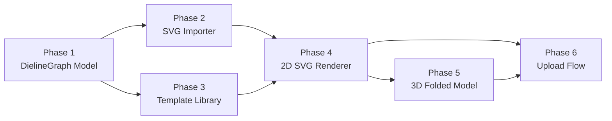

# Dieline System — Implementation Plan

> **Core problem:** You don't have one box type — you have **thousands** of packaging concepts. You need a system that can handle **any** dieline shape, not just a hardcoded folding carton.

---

## The Three Possible Approaches

After researching how Pacdora, Fantastic Fold, Origami/Boxshot, and templatemaker.nl solve this, there are **3 strategies**. Here's the honest assessment of each:

### ❌ Approach A — Visual Dieline Editor (Draw your own)
Build a full canvas-based CAD editor where users draw faces, add fold lines, connect panels.

**Why not:** This is building Illustrator/ArtiosCAD from scratch. It would take 6+ months of dedicated development and requires deep computational geometry expertise (DCEL data structures, sweep-line algorithms, polygon triangulation). Not realistic as a starting point.

### ⚠️ Approach B — Parametric Template Library (Pacdora's approach)
Pre-build 50+ packaging templates as TypeScript functions, each generating geometry from user dimensions.

**Why not first:** This is what we had in the old plan — it works but doesn't scale. Each new box type requires a developer to code the geometry from scratch. For thousands of concepts, you'd need to code thousands of templates. Good as a supplement, but not the core system.

### ✅ Approach C — SVG Dieline Import (Fantastic Fold's approach) ← **RECOMMENDED START**
Users design their dieline in Illustrator/Inkscape/any vector tool, export as SVG with two layers (**CUTS** + **CREASES**), upload to FoldView. The system:

1. **Parses** the SVG paths
2. **Detects faces** automatically (closed regions between cut + fold lines)
3. **Builds the 3D model** by folding panels along crease lines
4. **Lets users assign artwork** to each detected face

**Why this wins:**
- Handles **any** packaging shape — pizza box, sleeve, display, pouch, hexagon, anything
- Leverages the designer's existing tools (Illustrator, Inkscape) — no new CAD UI to build
- The algorithm is well-documented (graph theory + computational geometry)
- Fantastic Fold and Origami/Boxshot prove this works in production
- Your printing house clients **already have dieline files** — this is their native workflow

---

## Recommended Strategy: SVG Import + Template Starter Library

```
┌─────────────────────────────────────────────────────────┐
│                    User's Entry Points                  │
│                                                         │
│  ┌─────────────────┐     ┌────────────────────────────┐ │
│  │  Upload SVG      │     │  Pick from Template Library │ │
│  │  (CUTS + CREASES │     │  (10-15 common types with  │ │
│  │   layers)        │     │   parametric dimensions)   │ │
│  └────────┬────────┘     └─────────────┬──────────────┘ │
│           │                            │                 │
│           ▼                            ▼                 │
│  ┌─────────────────────────────────────────────────────┐ │
│  │           Unified Dieline Model (DielineGraph)      │ │
│  │                                                     │ │
│  │   • faces[] — detected closed regions (polygons)    │ │
│  │   • creases[] — fold edges between faces            │ │
│  │   • cutPaths[] — exterior boundary paths            │ │
│  │   • faceTree — parent/child hierarchy for folding   │ │
│  └─────────────────────────┬───────────────────────────┘ │
│                            │                             │
│           ┌────────────────┼────────────────┐            │
│           ▼                ▼                ▼            │
│    ┌────────────┐  ┌─────────────┐  ┌──────────────┐    │
│    │ 2D Dieline │  │ 3D Preview  │  │ Artwork      │    │
│    │ SVG View   │  │ Three.js    │  │ Assignment   │    │
│    │ (flat)     │  │ (folded)    │  │ (per face)   │    │
│    └────────────┘  └─────────────┘  └──────────────┘    │
└─────────────────────────────────────────────────────────┘
```

---

## Phase 1 — The Unified Dieline Model

**Duration:** 3–4 hours  
**Files:** `domain/dieline/DielineGraph.ts` (new), `domain/dieline/types.ts` (new)

This is the **core data structure** that everything else reads from. Whether the dieline comes from an SVG upload or a parametric template, it all becomes the same `DielineGraph`.

### Types

```typescript
/* ── A single polygon face detected from the dieline ───────── */
export type DielineFace = {
  id: string;                            // auto-generated: "face-0", "face-1", etc.
  label: string;                         // user-editable: "Front", "Back", "Lid", etc.
  /** Ordered polygon vertices (in mm coordinates) */
  vertices: Array<{ x: number; y: number }>;
  /** Centroid for label placement */
  centroid: { x: number; y: number };
  /** Bounding box (for artwork crop aspect ratio) */
  bounds: { x: number; y: number; width: number; height: number };
  /** Is this a main panel or a structural flap? */
  role: "panel" | "flap" | "glue" | "unknown";
  /** Can artwork be uploaded to this face? */
  artworkEnabled: boolean;
};

/* ── A crease (fold) line between two faces ─────────────────── */
export type DielineCrease = {
  id: string;
  /** The two faces this crease connects */
  faceA: string;                         // face ID
  faceB: string;                         // face ID
  /** Shared edge as two endpoints (mm coordinates) */
  edgeStart: { x: number; y: number };
  edgeEnd: { x: number; y: number };
  /** Fold angle in radians (default: Math.PI / 2 for a 90° box) */
  foldAngle: number;
  /** Fold direction: +1 for mountain, -1 for valley */
  direction: 1 | -1;
};

/* ── An exterior cut path (may be curved) ───────────────────── */
export type DielineCutPath = {
  id: string;
  /** SVG path "d" attribute (supports curves, arcs, etc.) */
  d: string;
};

/* ── The full dieline graph ─────────────────────────────────── */
export type DielineGraph = {
  /** Total bounds of the flat dieline (mm) */
  size: { width: number; height: number };
  /** All detected faces */
  faces: DielineFace[];
  /** All fold/crease lines */
  creases: DielineCrease[];
  /** Exterior cut boundary paths */
  cutPaths: DielineCutPath[];
  /** Face hierarchy — which face is the "root" (bottom face),
      and which faces fold relative to which parent */
  faceTree: DielineFaceNode[];
  /** Original SVG source (for re-rendering) */
  sourceSvg?: string;
};

/* ── Face tree node for hierarchical folding ────────────────── */
export type DielineFaceNode = {
  faceId: string;
  /** The crease this face folds along (relative to parent) */
  creaseId: string | null;               // null for the root face
  children: DielineFaceNode[];
};
```

### Why This Model Is Powerful

- **Any shape works** — faces are arbitrary polygons, not just rectangles
- **Curved cuts are native** — SVG path `d` attribute supports Bézier curves, arcs, anything
- **Face hierarchy enables 3D folding** — the tree structure tells Three.js exactly how to pivot each panel
- **Artwork mapping is face-based** — each face has bounds for aspect-ratio-locked cropping
- **Template generators produce the same output** — both SVG import and parametric templates output a `DielineGraph`

---

## Phase 2 — SVG Dieline Importer

**Duration:** 5–6 hours  
**Files:** `domain/dieline/svgImporter.ts` (new)  
**Dependencies:** none (pure TypeScript, uses DOMParser)

This is the algorithmic core. It takes a raw SVG string and produces a `DielineGraph`.

### The Algorithm (Step by Step)

```
SVG File
  │
  ▼
┌─────────────────────────────────┐
│ Step 1: Parse SVG with          │
│         DOMParser               │
│                                 │
│ • Find layer/group named        │
│   "CUTS" (or red strokes)       │
│ • Find layer/group named        │
│   "CREASES" (or blue/dashed)    │
└──────────────┬──────────────────┘
               │
               ▼
┌─────────────────────────────────┐
│ Step 2: Flatten all paths       │
│         into line segments      │
│                                 │
│ • Convert <path>, <line>,       │
│   <rect>, <polyline> to         │
│   arrays of {x,y} → {x,y}      │
│ • Subdivide curves into ~16     │
│   straight segments each        │
│ • Store original SVG paths for  │
│   curved cut rendering          │
└──────────────┬──────────────────┘
               │
               ▼
┌─────────────────────────────────┐
│ Step 3: Build the planar graph  │
│                                 │
│ • Endpoints = nodes             │
│ • Segments = edges              │
│ • Snap nodes within ε=0.5mm    │
│ • Find all intersections and    │
│   split edges at those points   │
└──────────────┬──────────────────┘
               │
               ▼
┌─────────────────────────────────┐
│ Step 4: Detect closed regions   │
│         (faces)                 │
│                                 │
│ • Walk the graph using the      │
│   "minimum cycle" algorithm:    │
│   at each node, always turn     │
│   left (smallest angle)         │
│ • Each cycle = one DielineFace  │
│ • Discard the outermost cycle   │
│   (it's the background)         │
│ • Compute centroid and bounds   │
│   for each face                 │
└──────────────┬──────────────────┘
               │
               ▼
┌─────────────────────────────────┐
│ Step 5: Classify edges          │
│                                 │
│ • Edge shared by 2 faces        │
│   = CREASE (fold line)          │
│ • Edge on only 1 face           │
│   = CUT (exterior boundary)     │
│ • Build DielineCrease[] and     │
│   DielineCutPath[]              │
└──────────────┬──────────────────┘
               │
               ▼
┌─────────────────────────────────┐
│ Step 6: Build face tree         │
│                                 │
│ • Auto-detect the largest face  │
│   as the root (or let user pick │
│   the "bottom" face)            │
│ • BFS/DFS from root through    │
│   creases to build the parent-  │
│   child hierarchy               │
│ • Each child folds along its    │
│   shared crease with its parent │
└──────────────┬──────────────────┘
               │
               ▼
         DielineGraph ✅
```

### SVG Layer Detection Strategy

The importer must be flexible about how the SVG is structured:

```typescript
function detectLayers(svgDoc: Document): { cuts: Element[]; creases: Element[] } {
  // Strategy 1: Named groups — <g id="CUTS"> / <g id="CREASES">
  // Strategy 2: Named layers — <g inkscape:label="CUTS">
  // Strategy 3: Stroke color — red = cuts, blue = creases
  // Strategy 4: Stroke style — solid = cuts, dashed = creases
  // Strategy 5: Single layer — all paths, classify by topology
  //             (exterior = cuts, shared edges = creases)
}
```

### Key Technical Detail: Minimum Cycle Detection

This is the hardest part algorithmically. The "minimum left-turn cycle" method:

```typescript
function findMinimumCycles(graph: PlanarGraph): Polygon[] {
  // 1. At each node, sort outgoing edges by angle
  // 2. For each directed edge (u → v), find the "next" edge
  //    by turning left (smallest counterclockwise angle from incoming direction)
  // 3. Follow the chain: u→v→w→...→u until you return to the start
  // 4. Each unique chain = one minimal face
  // 5. Filter out the outer boundary (largest area, wrong winding order)
}
```

This is a well-known algorithm in computational geometry. There are JavaScript implementations available in `flatten-js` and similar libraries, but it can also be written from scratch in ~150 lines.

### Acceptance Criteria — Phase 2

- [ ] Upload an SVG with named CUTS/CREASES layers → correctly detects all faces
- [ ] Upload an SVG with only stroke colors → falls back to color-based detection
- [ ] Handles curves (quadratic Bézier, cubic Bézier, arcs)
- [ ] Handles non-rectangular faces (hexagons, trapezoids, rounded panels)
- [ ] Produces a valid `DielineGraph` with correct face tree
- [ ] Pure TypeScript — no React, no DOM (uses DOMParser only)

---

## Phase 3 — Parametric Template Library (Quick Wins)

**Duration:** 3–4 hours  
**Files:** `domain/dieline/templates/` (new directory)

Build 10–15 common box types as functions that output `DielineGraph`:

| # | Template | Industry Code | Shape |
|---|---|---|---|
| 1 | Straight Tuck End (STE) | FEFCO 0211 | Standard retail box |
| 2 | Reverse Tuck End (RTE) | FEFCO 0210 | Tuck flaps on opposite ends |
| 3 | Auto-Lock Bottom | ECMA A20.20 | Self-assembling bottom |
| 4 | Sleeve / Belly Band | — | Simple wrap, no top/bottom |
| 5 | Pizza Box | FEFCO 0426 | Top-opening with lock tab |
| 6 | Mailer Box | FEFCO 0427 | E-commerce style |
| 7 | Pillow Box | — | Curved top/bottom |
| 8 | Tray with Lid | — | Separate tray + lid |
| 9 | Display Box | FEFCO 0715 | Open-front counter display |
| 10 | Hexagonal Box | — | Six-sided special |
| 11 | Gable Top | — | Milk carton style top |
| 12 | Drawer Box | — | Sliding inner + outer |

Each template is a single function:

```typescript
// domain/dieline/templates/straightTuckEnd.ts
export function generateStraightTuckEnd(
  width: number, depth: number, height: number
): DielineGraph {
  // Compute all vertices, faces, creases, cut paths
  // Return a DielineGraph identical to what the SVG importer would produce
}
```

### Template Picker UI

A visual gallery in the builder where users see thumbnail previews of each template type, click one, enter dimensions, and get a fully-generated `DielineGraph`.

### Acceptance Criteria — Phase 3

- [ ] At least 5 templates working at launch (STE, RTE, Pizza, Sleeve, Mailer)
- [ ] Each template produces a valid `DielineGraph`
- [ ] Changing dimensions regenerates the graph instantly
- [ ] Template picker shows visual thumbnails

---

## Phase 4 — 2D Dieline Renderer (SVG View)

**Duration:** 3–4 hours  
**Files:** `features/builder/components/DielineRenderer.tsx` (replaces `DielineUploader.tsx` + `DielineGuideOverlay.tsx`)

A new unified component that renders any `DielineGraph` as an interactive SVG:

### Layer Stack

```
Bottom → Top:
1. Grid background (CSS)
2. Flap fills — light gray for structural flaps
3. Panel fills — white for main artwork faces
4. Artwork images — <image> elements clipped to face polygons
5. Cut paths — red solid lines (SVG <path>)
6. Crease lines — blue dashed lines
7. Face labels — centered text with dimensions
8. Upload/action overlays — hover-triggered per face
```

### Per-Face Interactions

Each detected face becomes an interactive zone:
- **Hover** → show face name + action bar
- **Upload** → file input for artwork
- **Apply selected** → use current library selection
- **Crop** → open crop modal with correct aspect ratio from face bounds
- **Delete** → remove artwork from this face
- **Rename** → click label to rename ("Front" → "Lid" → "Sleeve")
- **Toggle artwork** → flaps can be toggled as artwork-enabled or structural-only

### SVG Clipping for Non-Rectangular Faces

```tsx
<defs>
  {graph.faces.map((face) => (
    <clipPath id={`clip-${face.id}`} key={face.id}>
      <polygon points={face.vertices.map(v => `${v.x},${v.y}`).join(" ")} />
    </clipPath>
  ))}
</defs>

{/* Artwork clipped to face polygon shape */}
<image
  href={faceArtwork[face.id]}
  clipPath={`url(#clip-${face.id})`}
  x={face.bounds.x}
  y={face.bounds.y}
  width={face.bounds.width}
  height={face.bounds.height}
/>
```

### Acceptance Criteria — Phase 4

- [ ] Renders any `DielineGraph` — rectangular, hexagonal, curved, arbitrary polygons
- [ ] Artwork is clipped to the exact face polygon shape
- [ ] Per-face upload/crop/delete works like before
- [ ] Faces can be renamed by clicking their label
- [ ] Cut lines (red), crease lines (blue) render with correct styles
- [ ] SVG is pannable and zoomable (for large/complex dielines)

---

## Phase 5 — 3D Folded Model from DielineGraph

**Duration:** 5–6 hours  
**Files:** `features/builder/CartonStage.tsx` (extend)

### The Folding Algorithm

The `faceTree` tells us exactly how to build the 3D scene graph:

```
Face Tree:                    Three.js Scene Graph:
                              
  bottom (root)               <group>  ← bottom face mesh
    ├─ front                    <group pivot={crease}>  ← rotated 90°
    │    └─ topTuck               <group pivot={crease}>  ← rotated ~100°
    ├─ back                     <group pivot={crease}>  ← rotated -90°
    │    └─ bottomTuck            <group pivot={crease}>
    ├─ left                     <group pivot={crease}>  ← rotated 90°
    │    └─ dustFlapL             <group pivot={crease}>
    └─ right                    <group pivot={crease}>  ← rotated -90°
         └─ glueTab               <group pivot={crease}>
```

For each face in the tree:

```typescript
function buildFaceGroup(
  node: DielineFaceNode,
  graph: DielineGraph,
  parentFace?: DielineFace,
): THREE.Group {
  const face = graph.faces.find(f => f.id === node.faceId)!;
  const crease = node.creaseId ? graph.creases.find(c => c.id === node.creaseId) : null;
  
  // 1. Create mesh from face polygon vertices
  const shape = new THREE.Shape();
  face.vertices.forEach((v, i) => {
    if (i === 0) shape.moveTo(v.x, v.y);
    else shape.lineTo(v.x, v.y);
  });
  const geometry = new THREE.ShapeGeometry(shape);
  
  // 2. Create pivot group at the crease edge position
  const pivotGroup = new THREE.Group();
  if (crease) {
    // Position the pivot at the crease midpoint
    // Rotate by the crease's fold angle
    pivotGroup.rotation.x = crease.foldAngle * crease.direction;
  }
  
  // 3. Offset the face mesh so it hangs from the crease edge
  const mesh = new THREE.Mesh(geometry, material);
  // Translate so the crease edge aligns with the pivot origin
  
  pivotGroup.add(mesh);
  
  // 4. Recursively add children
  for (const child of node.children) {
    pivotGroup.add(buildFaceGroup(child, graph, face));
  }
  
  return pivotGroup;
}
```

### Fold Animation Toggle

A button in the 3D toolbox: **"Unfold"** — animates all fold angles from 90° → 0° using `useFrame` or GSAP, showing the box flattening into the dieline layout.

### Acceptance Criteria — Phase 5

- [ ] 3D model correctly renders any `DielineGraph` as a folded box
- [ ] Non-rectangular faces (hexagons, curved tuck flaps) render correctly
- [ ] Artwork textures map to the correct faces
- [ ] Fold/unfold animation works smoothly
- [ ] Camera auto-adjusts to fit the model

---

## Phase 6 — Upload Flow & Project Migration

**Duration:** 2–3 hours  
**Files:** `store/dielineSlice.ts` (new), `hooks/useDielineImport.ts` (new), updated builder panels

### New Redux Slice

```typescript
type DielineState = {
  graph: DielineGraph | null;
  source: "template" | "svg-upload" | null;
  templateId: string | null;
  importError: string;
  isImporting: boolean;
};
```

### Builder UI Flow

```
┌──────────────────────────────────────────┐
│          Choose Your Starting Point      │
│                                          │
│  ┌───────────────┐  ┌─────────────────┐  │
│  │  📦 Template  │  │  📄 Upload SVG  │  │
│  │   Library     │  │   Dieline       │  │
│  └───────┬───────┘  └────────┬────────┘  │
│          │                   │           │
│          ▼                   ▼           │
│  ┌─────────────────────────────────────┐ │
│  │    Dieline Loaded — Start Design    │ │
│  │                                     │ │
│  │  [2D Dieline View]  [3D Preview]    │ │
│  │  [Assign Artwork]   [Crop]          │ │
│  └─────────────────────────────────────┘ │
└──────────────────────────────────────────┘
```

### Project Data Migration

Existing projects with the old `faces: { front, back, left, right, top, bottom }` format must still work. The migration strategy:

```typescript
// When loading an old project, auto-generate a DielineGraph
// from the basic folding-carton template using saved dimensions
function migrateOldProject(project: Project): DielineGraph {
  return generateStraightTuckEnd(
    project.dimensions.width,
    project.dimensions.depth,
    project.dimensions.height,
  );
}
```

### Acceptance Criteria — Phase 6

- [ ] New projects start with a "choose template or upload" step
- [ ] Old projects auto-migrate to the new dieline system
- [ ] SVG upload validates the file and shows helpful errors
- [ ] Template picker shows visual thumbnails with dimension inputs

---

## Execution Order



**Critical path:** Phase 1 → Phase 2 → Phase 4 → Phase 5

---

## Estimated Total Effort

| Phase | Hours | Difficulty | Parallelizable |
|---|---|---|---|
| 1 — DielineGraph model | 3–4 | Low | — |
| 2 — SVG importer | 5–6 | **High** (algorithm) | — |
| 3 — Template library | 3–4 | Medium | ✅ with Phase 2 |
| 4 — 2D SVG renderer | 3–4 | Medium | — |
| 5 — 3D folded model | 5–6 | **High** (Three.js) | — |
| 6 — Upload flow + migration | 2–3 | Low | — |
| **Total** | **21–27** | | |

---

## Key Libraries to Consider

| Library | Purpose | Size |
|---|---|---|
| `flatten-js` | 2D computational geometry (polygon ops, intersections, DCEL) | ~45KB |
| `svg-path-parser` | Parse SVG `d` attributes into command arrays | ~5KB |
| `earcut` | Triangulate polygons for Three.js mesh generation | ~8KB |
| `three` (SVGLoader) | Already installed — can import SVG paths into Three.js shapes | built-in |

> [!NOTE]
> The heaviest dependency is `flatten-js` for the minimum-cycle face detection. If you want to keep the bundle small, the algorithm can be written from scratch in ~200 lines — it's well-documented in computational geometry textbooks.

---

## What This Enables Long-Term

Once the `DielineGraph` pipeline is in place, you can add:

- **Dieline marketplace** — users share/sell their dieline templates
- **AI dieline generation** — describe a box in words, generate the SVG
- **Paper thickness simulation** — offset faces by material caliper
- **Multiple die lines per project** — inner liner + outer sleeve
- **Dieline diff tool** — compare revisions visually
- **Production export** — DXF, AI, PDF with named layers
- **Cost calculator** — compute material area from the dieline graph
